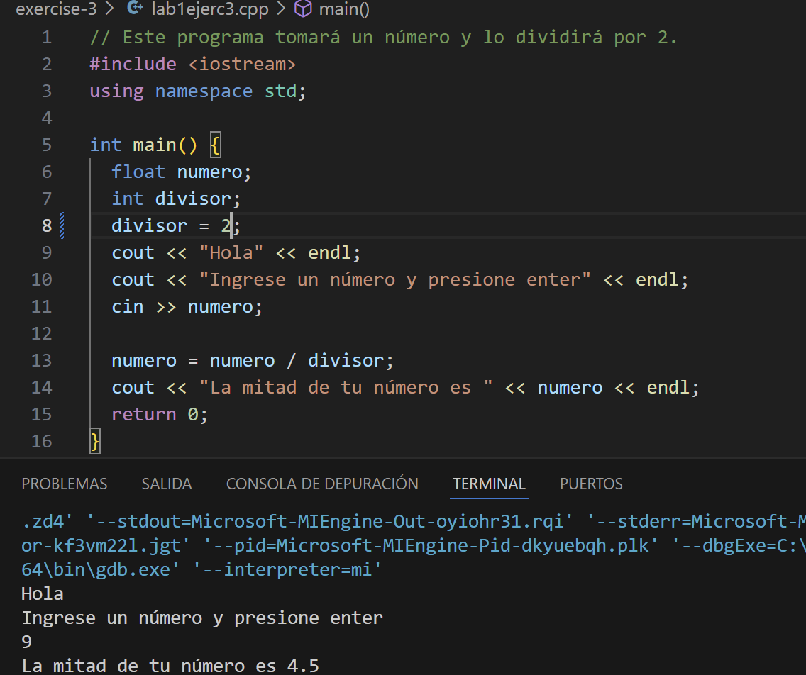
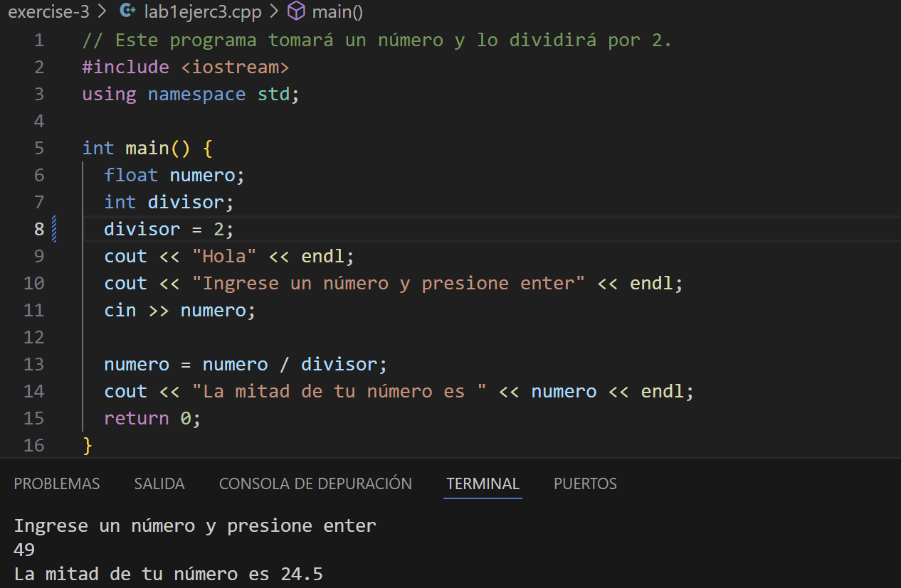

# Ejercicio de laboratorio 3: ejecución de un programa con un error de tiempo de ejecución

## 🛠️ Instrucciones

1. Revisa el programa del archivo denominado lab1ejerc3.cpp.
2. \\**Compilar el programa**\\. No debería obtener errores de sintaxis.
3. \\**Ejecutar el programa**\\. Ahora debería ver el primero de varios errores en tiempo de ejecución. No había errores de sintaxis o gramaticales en el programa; Sin embargo, al igual que ordenar a alguien que rompa una ley de la naturaleza, el programa le pide a la computadora que rompa una ley de las matemáticas dividiendo por cero. No se puede hacer. Corrija este programa haciendo que el código se divida por 2 en lugar de 0.
4. \\**Vuelva a compilar y ejecutar el programa**\\. Escriba 9 cuando se le solicite información. Registre lo que se imprime.
5. \\**Ejecutar el programa**\\ con valores diferentes. Registre la salida. \\**¿Sientes que estás obteniendo resultados válidos?**\\

## ✅ Resultado

