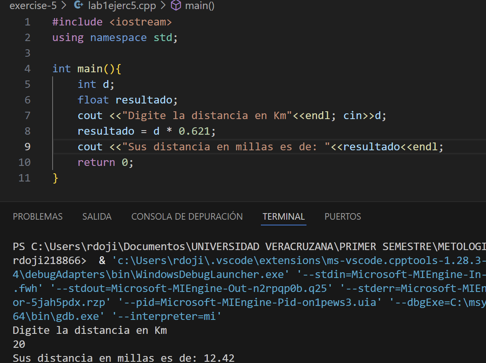

# Ejercicio de laboratorio 5 – Escribe tu primer programa

## 🛠️ Instrucciones

1. Escriba un programa de C++ que lea un número que represente el número de kilómetros recorridos. La salida convertirá este número en millas. 1 kilómetro = 0.621 millas. Llame a este programa lab1ejerc5.cpp.
2. \\**Compilar el programa**\\. Si obtiene errores de compilación, intente corregirlos y vuelva a compilar hasta que su programa esté libre de errores de sintaxis.
3. \\**Ejecutar el programa**\\. ¿El resultado es lo que espera de la información que dio? Si no es así, intente encontrar y corregir el error lógico y vuelva a ejecutar el programa. Continúe este proceso hasta que tenga un programa que produzca el resultado correcto.

## ✅ Resultado

